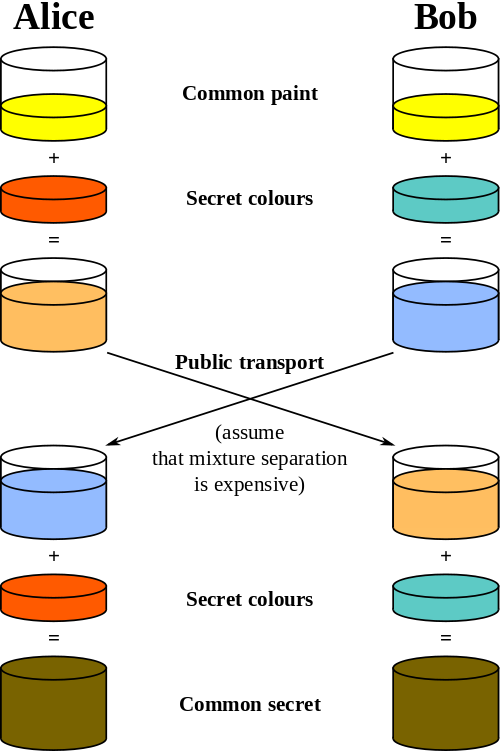
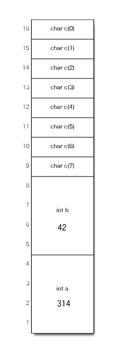

情報セキュリティ技術入門
========================
於 2013/09/08 関西情報系学生団体交流会

京都産業大学文化団体連盟所属電子計算機応用部(C.A.C.)

【本名部分削除】(tasuten)


自己紹介 + 前説
---------------

### 1年越しのお前誰や
* 名前： 【本名部分削除】 a.k.a. tasuten
* 所属：
    * 京都産業大学
        * コンピュータ理工学部ネットワークメディア学科3回生
        * 文化団体連盟所属電子計算機応用部
* OSC京都のローカルスタッフとかもやってます
* 今年春の情報セキュリティスペシャリスト試験に合格
* [Twitter@tasuten](https://twitter.com/tasuten)
* <http://about.me/tasuten>

### どどーん


### この勉強会の流れ
* 基本的にはずっと私が話す感じです
    * 気になったところで適当に茶々とか質問入れて下さい
    * ちょいちょい実例も入れる予定
* 話の中身は
    1. 前説 + 自己紹介（←イマココ）
    2. 情報セキュリティとは
    3. 情報セキュリティを支える技術（防御側）
    4. 情報セキュリティを脅かす攻撃手法（攻撃側）
    5. まとめ（参考文献など）
* この資料は以下から閲覧可能
    * https://www.dropbox.com/s/tkppnzs1292u6v9/security.zip

### 免責事項
* この勉強会においては私の知識（＋参考文献）に基づきいろいろ説明させて頂きますが、記憶違いや誤解などが多々あると思われます。
* 故に、この勉強会の内容を利用することによって発生したいかなる損害、不利益に対しても責任は負いかねます
* とどのつまり、自己責任でね！ということです。
* ですが皆様の情報セキュリティへの理解に微力でも尽力出来れば幸いです。


情報セキュリティとはなにか
--------------------------

### 情報セキュリティと聞いて思い浮かべるもの
<article class='smaller'>

* コンピュータウイルス？
* スパイウェア？
* トロイの木馬？
* アンチウイルスソフト？
* 情報漏えい？
* ファイアーウォール？
* ソーシャルエンジニアリング？
* クラッキング？
* パスワード？
* HTTPS？
* SSL？
* 監視カメラ？
* 暗号？

</article>

### 情報セキュリティの定義
<article class='smaller' style='font-style: italic'>
<q>情報の<span class='red'>機密性</span>，<span class='blue'>完全性</span>及び<span class='green'>可用性</span>を維持すること。</q>
<span style='font-size: smaller'>
[JIS Q 27002:2006 (ISO/IEC 27002:2005) 「2. 用語及び定義」より](http://kikakurui.com/q/Q27002-2006-01.html "JIS Q 27002:2006 情報技術—セキュリティ技術—情報セキュリティマネジメントの実践のための規範")
</span>
</article>

### 機密性、完全性、可用性とは

<article class='smaller'>
#### <span class='red'>機密性(Confidentiality)</span>
情報へのアクセスは、許可された者のみがアクセスでき、許可されてないものはアクセスさせないこと

#### <span class='blue'>完全性(Integrity)</span>
情報及びその処理方法が正確で完全であるようにすること。

例えば、情報が破壊、改竄されたり、情報システムが勝手に変更されたり、情報が誤って削除・変更されたりしないようにすること。

#### <span class='green'>可用性(Availability)</span>
許可された利用者が、必要なときにいつでも情報にアクセス出来るようにすること。

例えば、負荷の増大によるサービス停止、システムのダウン、自然災害などにより情報にアクセス出来なくなることを防ぐこと。

<span class='footnote'>
* 『情報セキュリティ教本』 / IPA 参考。またこれらは頭文字を取って「情報のCIA」とも言われる</span>
</article>

### 実は先程の定義には続きが有って…
<article class='smaller' style='font-style: italic'>
<q>さらに，真正性，責任追跡性，否認防止及び信頼性のような特性を維持することを含めてもよい。</q>
<span style='font-size: smaller'>
再: [JIS Q 27002:2006 (ISO/IEC 27002:2005) 「2. 用語及び定義」より](http://kikakurui.com/q/Q27002-2006-01.html "JIS Q 27002:2006 情報技術—セキュリティ技術—情報セキュリティマネジメントの実践のための規範")
</span>
</article>

### 真正性、責任追跡性、否認防止、信頼性
* 真正性（しんせいせい、Authenticity）
    * 利用者のなりすましや、偽の情報がないことが証明できること
* 責任追跡性(Accountability)
    * ユーザやシステムなどの動作を、その動作から動作主を一意に特定出来ることを保証すること
* 否認防止(non-repudiation)
    * ある活動又は事象が起きたことを、後になって否認されないように証明する能力
* 信頼性(Reliability)
    * 動作及びその結果が意図した通りであるようにすること

<span class='footnote'>
* 『情報セキュリティ教本』 / IPA 参考
</span>


### 他の情報セキュリティ用語
* リスク(Risk)
    * 何らかの損失を発生させうる事象の発生確率と事象の結果の組み合わせ
* 脆弱性(Vulnerability)
    * リスクを発生させうるシステムの弱点
* 脅威(Threat)
   * 守るべき情報資産に対して良くない影響を及ぼす事象。盗難、不正利用、停電、システムの故障など人為的なものと、自然災害のような環境的なものがある。
* インシデント(Incident)
    * 発生する可能性が高い脅威

<span class='footnote'>
* 『情報セキュリティ教本』 / IPA 及び[情報セキュリティ - Wikipedia](http://ja.wikipedia.org/wiki/%E6%83%85%E5%A0%B1%E3%82%BB%E3%82%AD%E3%83%A5%E3%83%AA%E3%83%86%E3%82%A3 "情報セキュリティ - Wikipedia")参考。正確な定義は先述の[JIS Q 27002](http://kikakurui.com/q/Q27002-2006-01.html "JIS Q 27002:2006 情報技術—セキュリティ技術—情報セキュリティマネジメントの実践のための規範")の用語集参照
</span>


情報セキュリティを支える技術<br />（防御側）
-------------------------------------------

### 本題に入る前に…
<article class='smaller'>

#### 「隠すことによるセキュリティ」<sup>1</sup>は危険
具体的には、特に暗号アルゴリズムにおいてそのアルゴリズムを隠すことに依存して安全性を確保しようとするのは良くないこととされる。
なぜなら、そのアルゴリズムが解読されてしまえば、その暗号は格段に弱くなる。また、どんな暗号もいつかは解読される。アルゴリズムが長年解読されないようにするのは困難。

それならば、暗号アルゴリズムを世界中に公開し、例えば世界中の専門家による評価・解読の試みを受けてそれでも尚安全であるようなアルゴリズムの方が安全といえる。
また、アルゴリズムが公開されていればアルゴリズムの暴露により暗号の強さが下がる危険性がない。

現在主流の暗号アルゴリズムのほとんどは「隠すことによるセキュリティ」に依らず、そのアルゴリズムが公開されており、世界中の専門家による評価・解読の試みを受けたものである。

なお、「隠すことによるセキュリティ」によって失敗した著名な例としてはDVD-Videoのコピーガード技術CSS（Jon Lech JohansenによるDeCSS）、RSA Security社のRC4（当時は企業秘密であったが匿名者があるMLに公開）などがある。

<span class='footnote'>
1: 「隠蔽によるセキュリティ」とも。[英]Security by obscurity<br />
[ケルクホフスの原理 - Wikipedia](http://ja.wikipedia.org/wiki/%E3%82%B1%E3%83%AB%E3%82%AF%E3%83%9B%E3%83%95%E3%82%B9%E3%81%AE%E5%8E%9F%E7%90%86 "ケルクホフスの原理 - Wikipedia")も参照。“暗号方式は、秘密鍵以外の全てが公知になったとして、なお安全であるべきである。”</span>

</article>

### この章の流れ
1. 暗号
    1. 共通鍵暗号
    2. 公開鍵暗号
    3. ハイブリッド暗号
2. 一方向ハッシュ関数
3. 乱数
4. その他


### 用語解説
<article class='smaller'>

* 平文(plaintext)
    * 暗号化前の、暗号化されていないデータ
* 暗号文(ciphertext)
    * 暗号化後のデータ。ただ見ただけでは意味の分からないデータに見える
* 暗号化(encryption)
    * 平文を秘密にするために、あるアルゴリズムなどに従ってそのままでは意味の分からないデータ（暗号文）に変換すること
* 復号（もしくは復号化）(decryption)
    * 正答な受信者が、意図された順序に則り暗号文を平文に戻すこと
* 鍵(key)
    * 暗号化及び復号に使われるある数値。公開鍵暗号の公開鍵などを除いては、大抵の場合秘密にしなければならない。鍵（もしくはその生成）には乱数が使われる
* Alice, Bob
    * 登場人物1, 2。3人目以降がいる場合はCarol or Charlie, Dave, Ellen, Frankなどと続く。
    * また、通信を盗み聞きする（ただし盗み聞きするだけで改竄はしない）盗聴者の名前としてEve、攻撃者（改竄までする）の名前としてMalloryなどがよく使われる<sup>1</sup>

（文章にするとよく分からないので次のページの*共通鍵暗号の場合の*図など参照）

<span class='footnote'>
1: それぞれ盗聴者(eavesdropper)、悪意のある(malicious)から
</span>
</article>

### 共通鍵暗号方式(Common Key Cryptosystem)
<article class='smaller'>

* 暗号化と復号化に同じ（共通の）鍵を使う暗号方式
* 一番簡単な例としてシーザー暗号がある
* 各文字をn文字後ろに/前にずらす暗号。nが鍵
    * caesar ー（**5**文字*後ろ*にずらす）→hfjxfw
    * hfjxfw ー（**5**文字*前*にずらす）→caesar
    * 鍵は「**5**」で共通
    * ご察しの通り、アルファベットなら最悪でも25通り試せば解けるので、とても弱い

共通鍵暗号の模式図

</article>

### 絶対に解読できない共通鍵暗号・使い捨てパッド
* 鍵: 平文と同じ長さのランダムビット列
* 暗号化: 平文と鍵のXORを取る
* 復号: 暗号文と鍵のXORを取る
* なぜ解読出来ないか:
    * 総当り攻撃を仕掛けても、平文と同じ長さのビット列全てが出てくるので、どれが元の平文か分からない
* ただし、使い捨てパッドは実際には用いられてない
    * 理由:
    * 平文と同じ長さの鍵を安全に送れるなら平文をそのまま送ればいい
    * 平文と同じ長さの鍵が復号に必ず必要なので、鍵と暗号文で2倍の容量を取る

### 他の共通鍵暗号の例
<article class='smaller'>

#### DES (Data Encryption Standard)
* 1976年アメリカの公式連邦情報処理標準として採用される
* ただし、今は時代遅れとなっている
* 鍵は56ビット（7ビット(残り1ビットはエラー検出)×8）
* ファイステル構造と呼ばれる処理方法を採用
* これにより、暗号化と復号をほぼ同じ処理で実現可能

#### トリプルDES (Triple-DES, 3DES)
* IBMが考案した、DESを鍵を変えて3回、暗号化→復号→暗号化の順に掛ける暗号
* 鍵は56×3 = 168ビット
* 暗号化→**復号**→暗号化なのは、3つとも同じ鍵を使うとDESと等価になるため（DESに対して上位互換性を持つ）
</article>

### 他の共通鍵暗号の例
#### AES (Advanced Encryption Standard)
* DESに代わる暗号となるべく2001年に連邦情報処理標準に採用される
* コンペ方式での標準決定が取られ、いくつかあるアルゴリズムからRijndael（ラインダール）がAESに採択される
* 設計者のベルギーのライメン(RIJmeN)氏とダーメン(DAEmen)氏でRIJNDAEL
* RijndaelはSPN構造と呼ばれる処理方法を採用している
* 鍵は128, 192, 256ビットのいずれか
* Torの通信の暗号化にも用いられる

### メッセージ認証コード (Message Authentication Code, MAC)
* 暗号ではないが、共通鍵暗号と同じく共通鍵の考えを用いることがある技術として取り上げる
* 暗号ではないので、文章を暗号化する訳*ではない*
* 代表的なものにハッシュ関数を用いたHMAC(Hash-based MAC)がある
* MACにより利用者の真正性（なりすましの有無）や、情報の完全性（改竄の有無）を確認できる
* MACは国際的な銀行間送金システムSWIFTやIPSec、SSL/TLSでも用いられている

### 鍵配送問題(Key Distribution Problem)
<article class='smaller'>

先述の共通鍵暗号及びMACには***「鍵を事前に安全に共有せねばならない」***という大きな問題がある。
#### 解決法
* 手渡しなどによる事前共有
    * インターネット越しの通信じゃとてもじゃないけど使えない
* 鍵配送センター(Key Distribution Center)
    * AliceとBobは鍵配送センターに事前にAlice専用、Bob専用の鍵を保存しておく<sup>1</sup>
    * 鍵配送センターは乱数で通信1回切り用の鍵(セッション鍵)を作る
    * セッション鍵をAliceとBobに対して、それぞれAliceへはAliceの鍵で、BobへはBobの鍵で共通鍵暗号で送る
    * AliceとBobはセッション鍵で共通鍵暗号化して通信する。通信が終わったらセッション鍵は捨てる
    * 問題点: 鍵配送センターに負荷及びリスクが集中
* 公開鍵暗号・ハイブリッド暗号（双方とも後述）
* Diffie-Hellman鍵交換（次項）

<span class='footnote'>
1: 会社ならば新入社員が入った時にその社員用の鍵を作り…と言った風に
</span>

</article>

### Diffie-Hellman鍵交換
<article class='smaller'>

離散対数問題<sup>1</sup>を効率的に解くアルゴリズムが未発見なことを用いる。
#### 実際の鍵交換アルゴリズム
1. ある巨大な素数Pを準備する
2. Pの生成元（後述）のうち素数のもののいずれかをGとする
3. AliceとBobのどちらかが上の1, 2を行い、P, Gをもう片方に送る。
4. Alice: 1〜(P-2)の間の整数からAを選びAliceだけの秘密にする<br />
   Bob: 1〜(P-2)の間の整数からBを選びBobだけの秘密にする
5. Alice: G<sup>A</sup> mod P = aを計算しBobへ送る<sup>2</sup><br />
   Bob: G<sup>B</sup> mod P = bを計算しAliceへ送る<sup>2</sup>
6. Alice: b<sup>A</sup> mod Pを計算する。<br />
   Bob: a<sup>B</sup> mod Pを計算する。
7. 6で出た結果は双方ともG<sup>AB</sup> mod Pとなり、AliceとBobはAとBを秘密にしたまま同じ値が共有できた。

<span class='footnote'>
1: 任意のA, B, Cが与えられた時A<sup>X</sup> mod B = CとなるXを求めるアルゴリズム<br />
2: 離散対数問題から、aからAを、bからBを求めるのは困難
</span>

</article>

### 生成元とは
例えばPとして5を考える。G, Aを1〜P-1としてG<sup>A</sup> mod Pの表を作る。

```
G\A| 1 2 3 4
------------
  1| 1 1 1 1 <= 重複がある（1は5の生成元でない）
  2| 2 4 3 1 <= 重複がない（2は5の生成元）
  3| 3 4 2 1 <= 重複がない (3も5の生成元)
  4| 4 1 4 1 <= 重複がある（4は5の生成元でない）
```

この場合、P = 5の生成元は2, 3。

実際に小さめの値でDiffie-Hellman鍵交換をやってみる？

（計算には`python`や`irb`などのREPLを使うといい）

### Diffie-Hellman鍵交換の分かりやすい図
<article class='smaller'>

<http://en.wikipedia.org/wiki/File:Diffie-Hellman_Key_Exchange.svg>


</article>

### 公開鍵暗号 (Public Key Cryptosystem)
<article class='smaller'>

* 数学的理論に基づき、暗号化と復号に別々の鍵を使う暗号方式。
* **暗号化に使う鍵（*公開鍵(public key)*）は公開できる。**
    * そのため、暗号化は誰でも出来る
* **復号に使う鍵（*秘密鍵(private key)*）は受信者のみの秘密**
    * そのため、復号は受信者にしか出来ない
* 公開鍵と秘密鍵は異なる値で、この2つを合わせて鍵ペア(key pair)と言う
* RSA暗号が特に有名。RSA暗号以外にはElGamal暗号、Rabin暗号、楕円曲線暗号などがある

公開鍵暗号模式図

</article>

### RSA暗号
* 代表的な公開鍵暗号
* 開発者のRivest, Shamir, Adlemanの頭文字でRSA
* 非常に大きな整数の高速な素因数分解が難しいことを利用
* 公開鍵（暗号化に使う鍵）を(E, N)、秘密鍵（復号に使う鍵）を(D, N)とすると、
    * 暗号文 = 平文<sup>E</sup> mod N
    * 平文 = 暗号文<sup>D</sup> mod N
* E, D, Nの決め方については後述
* Nについては、実際には1024〜4096ビットの数（凡そ10<sup>300</sup>〜10<sup>1200</sup>）を用いている

### RSA暗号での鍵の決め方
<article class='smaller'>

1. 非常に大きな素数p, qを用意し、N = p×qとする。<sup>1</sup>p, qは秘密のままにする<sup>2</sup>
2. L = lcm(p-1, q-1)とする（lcmは最小公倍数）
3. 1 < E < Lかつgcd(E, L) = 1なるEを求める（gcdは最大公約数）<sup>3</sup>
4. 1 < D < LかつE×D mod L = 1なるDを求める<sup>4</sup>
5. (E, N)が公開鍵、(D, N)が秘密鍵となる。(E, N)を公開する。

具体的には、AliceがBobにメッセージを送りたい場合、Bobが上記操作を行い、(D, N)（のD）を秘密にしたまま、(E, N)のみをAliceに公開し、Aliceは暗号文 = 平文<sup>E</sup> mod NをBobに送り、Bobは平文 = 暗号文<sup>D</sup> mod Nで復号する。


<span class='footnote'>
1: p, qについては、まず擬似乱数生成器で大きな数を作り、それが素数かをAPR判定法やAKS判定法で判定する。<br />
2: なお、大きな数の素因数分解の困難性からNからp, qを割り出すことは困難だが、p, qが割れると秘密鍵を含めたN, L, E, D全てが分かってしまうので、p, qは秘密にする<br />
3: 同じく1〜Lの数1つを擬似乱数生成器で生成し、ユークリッドの互除法などで最大公約数を求め1になるまで生成・判定を繰り返す。また、gcd(E, L) = 1なのでEとLは「互いに素」であるとも言う<br />
4: 同じく擬似乱数生成器を使ってDの候補dを作り、E×d mod Lを計算して判定する
</span>

</article>

### 電子署名<sup>1</sup>(Electronic Signature)
* 公開鍵暗号ではないが、公開鍵暗号と同じ考え方に基づく技術として紹介
* 暗号ではないので、文章を暗号化する訳*ではない*
* 考え方としては、**「秘密鍵を知るのは暗号化するその人のみ」**という考えから**「秘密鍵を知っているならばその人であると証明できる」**という考えに基づく
* 具体的にはAliceが自らの秘密鍵で署名を行い、Bob, Carol, Daveらが公開鍵でその署名を検証する
* 電子署名により送信者の真正性（なりすましの有無）や、情報の完全性（改竄の有無）、それに加えて*否認防止*（送信者が「そんなこと言ってない」と後で否定する）を確保できる

<span class='footnote'>
1: デジタル署名とも
</span>

### 電子署名の流れ
<article class='smaller'>

Aliceがメッセージに署名を行い、それをBobとCarolが検証する場合を考える。

署名

1. Aliceは秘密鍵と公開鍵を作り、公開鍵を公開する
2. Aliceはメッセージのハッシュ値を取り、そのハッシュ値を秘密鍵で「暗号化」する
3. メッセージ本体と署名をBob, Carolに送る

検証

1. Bobは送られてきたメッセージ本体と署名を切り離す。
2. Bobは署名を公開鍵で「復号」する。その結果をS1とする
3. Bobはメッセージ本体のハッシュ値を取り、その結果をS2とする
4. BobはS1とS2が一致するか確認する。一致すれば署名の検証は成功で、改竄やなりすまし無く、確かに本人が送った通りであることを確認できる。
5. Carolも同様にして検証を行う

</article>

### 共通鍵暗号と公開鍵暗号の比較
<table>
<tr>
<th>各性質</th>
<th>共通鍵暗号</th>
<th>公開鍵暗号</th>
</tr>
<tr>
<td><b>鍵配送問題</b></td>
<td>解決する必要あり</td>
<td>解決する必要無し</td>
</tr>
<tr>
<td><b>鍵の数<br />(n人)</b></td>
<td><sub>n</sub>C<sub>2</sub> = O(n<sup>2</sup>)</td>
<td>2n = O(n)</td>
</tr>
<tr>
<td><b>速度</b></td>
<td>速い</td>
<td>遅い（共通鍵暗号の数百倍）</td>
</tr>
</table>
公開鍵暗号には、速度面での欠点がある。

→両者を組み合わせた「ハイブリッド暗号」を利用

### ハイブリッド暗号
<article class='smaller'>

一言で言うと、**「スピードアップのためメッセージ本体は*共通鍵暗号*で暗号化」**し、**「鍵配送問題を解決するため共通鍵は*公開鍵暗号*で暗号化」**する

暗号化（AliceがBobに送る場合）

1. Aliceはセッション鍵を擬似乱数生成器で作り、その鍵を使い共通鍵暗号でメッセージを暗号化
2. Aliceは共通鍵暗号のセッション鍵を受信者(Bob)が生成した公開鍵で暗号化
3. Aliceは暗号文と、暗号化したセッション鍵を、一緒にしてBobに送る。

復号（AliceがBobに送る場合）

1. BobはAliceから届いた暗号文と暗号化されたセッション鍵を分ける
2. Bobは自らの秘密鍵でセッション鍵を復号
3. 復号されたセッション鍵を使って、共通鍵暗号でメッセージ本体の暗号文を復号
4. 3で平文が得られる
</article>


### 一方向ハッシュ関数(one-way hash function) [I]
<article class='smaller'>

* 暗号技術に用いられるような一方向ハッシュ関数は、ある任意長の入力データ（メッセージ）から、ある一定長の値（ハッシュ値）を
    * 高速に
    * メッセージが1ビットでも異なれば、殆どの場合でハッシュ値は大きく変化するように
    * 同じメッセージは同じハッシュ値を持つように（決定性）
    * ハッシュ値から元のメッセージを推測できないように（一方向）
    * 弱衝突耐性及び強衝突耐性を持つように（後述）
* 求められるような数学的関数である
* 衝突耐性
    * 弱衝突耐性
        * あるメッセージのハッシュ値が与えられた時、そのハッシュ値と同じハッシュ値を持つ全く別のメッセージを求めることが困難である
        * 言い方を変えると、ハッシュ値を変えずにメッセージを改竄出来ないような性質
    * 強衝突耐性
        * 同じハッシュ値を持つ異なる2つのメッセージを見つけることが困難である
</article>

### 一方向ハッシュ関数 [II]
<article class='smaller'>

#### 一方向ハッシュ関数の応用例
* ソフトウェアをインターネット上で配布する際の改竄検出
    * 例: <http://www.ubuntulinux.jp/download/ja-remix>
* メッセージ認証コード、電子署名
* パスワードの保存（所謂パスワードのハッシュ化）
    * UNIX系OSなどでは、一般にcryptと呼ばれるコマンド及び関数などが搭載されており、saltと呼ばれる短い乱数データとパスワードを一緒に一方向ハッシュ関数に掛けて、パスワードを平文で保存しないようにする

#### 代表的な一方向ハッシュ関数
* MD4, MD5
* SHA1, SHA-2(SHA-256, SHA-384, SHA-512)
</article>

### 乱数(Random Number)
<article class='smaller'>

* 乱数は、暗号技術では例えば暗号の鍵や、先述のsalt、他にはnonce等の生成に使われる
* 乱数には以下の性質が定義されている
    * 無作為性
        * 生成される乱数列に統計的偏りがない
    * 予測不可能性
        * それより前の乱数列から、次の乱数を予測出来ない
    * 再現不可能性
        * 同じ乱数列を二度と再現できない。生成の後使うには乱数そのものを保存しておくしかほかない
* 無作為性のみを持つものを「弱い乱数」、それに加えて予測不可能性を持つものを「強い乱数」、さらに再現不可能性まで持つものを「真の乱数」と言う。
* 暗号技術では「強い乱数」以上の乱数が必要

</article>

### 擬似乱数生成器(Pseudo Random Number Generator, PRNG)
<article class='smaller'>

* ソフトウェア的には、再現不可能性を持つ「真の乱数」を作るのは不可能
* 再現不可能性を持つ乱数を作るには熱や音、宇宙線等のハードウェア的情報を必要とする<sup>1</sup>
* そのため、多くの場合はソフトウェア的な**擬似**乱数生成器(PRNG)を用いる
* 擬似乱数生成器は要は数学的なものなので、乱数の種(seed)が必要
    * この種は推測可能であってはならない。つまり、良くある「現在時刻を種にする」のは実は良くない
* 代表的な擬似乱数生成アルゴリズムには線形合同法<sup>2</sup>、Xorshift、メルセンヌ・ツイスタなどがある
* 上記アルゴリズムは全て「弱い乱数」であるので暗号技術には使えない
* 暗号技術に用いるためには予測不可能性を持った「強い乱数」で必要があるので、内部では一方向ハッシュ関数等を用いて予測不可能性を持たせてる
* 暗号技術に用いる様な擬似乱数生成器を*暗号論的*擬似乱数生成器(Cryptographically Secure PRNG, CRPRNG)と言う

<span class='footnote'>
1: そのため、最近のCPUには物理的な乱数生成器が乗っているものもある。[冷蔵庫は本棚でした: Ivy BridgeではCPUに物理乱数生成器が乗るらしい](http://tech-tw.blogspot.jp/2012/01/ivy-bridgecpu.html "冷蔵庫は本棚でした: Ivy BridgeではCPUに物理乱数生成器が乗るらしい")。ちなみに、物理情報なら（重さや振り方に偏りがない）サイコロでもいい<br />
2: 簡単なので非常に良く用いられているが、暗号列自体の周期が短いなど様々な短所を持つ<br />
</span>
</article>

### その他
* 公開鍵暗号で公開鍵は本当にBobのものか？
    * 公開鍵証明書、認証局(CA)、公開鍵基盤(PKI)
* 暗号技術の実際の応用
    * PGP
    * SSL/TLS

情報セキュリティを脅かす攻撃手法<br />（攻撃側）
-----------------------------------------------

### 本題の前に謝罪
* こっからの節は、執筆者のいろんな都合で時間がなく、かなり簡素な説明になっております
* また、私個人も今までの節程このジャンルに精通しているわけではありません
* ですので、出来れば気になった項目は各自で調べて下さい。すいません

### バッファオーバーフロー (Buffer Overflow) [I]
#### 前提知識
例えばC言語などだと、ローカル変数やリターンアドレス（関数呼び出し後の戻り先のアドレス）などは、コールスタックと呼ばれるスタック領域に格納される。

例えば

``` c
int main(int argc, char *argv[])
{
  int a = 314;
  int b = 42;
  char c[8];
  return 0;
}
```

だと

### バッファオーバーフロー [II]


### バッファオーバーフロー [III]
<article class='smaller'>

さっきの例だと、char c[8]は要素8の配列だった。
じゃあ、こんなコードだと？

``` c
#include <stdio.h>
#include <string.h>

int main(int argc, char *argv[])
{
  int auth_flag = 0;
  char input[8];
  scanf("%s", input);

  if (strcmp(input, "passwd") == 0) {
    auth_flag = 1;
  }

  if (auth_flag) {
    printf("OK\n");
  } else {
    printf("NG\n");
  }
  return 0;
}
```

**この場合の*scanfは文字数のチェックをしない。*じゃあ、inputに入りきらない文字列を入力すると？** →やってみる

</article>

### バッファオーバーフローを起こしたスタックの図


### バッファオーバーフローまとめ
<article class='smaller'>

* 一般に、入力される文字列などの長さが想定されているバッファの長さよりオーバーした時に、その後ろの領域のデータを破壊もしくは改竄出来てしまう脆弱性
* 今回の場合コールスタック内部のみで行われたが、ヒープ領域なども利用し、例えばヒープ領域やスタック内に送り込んだ悪意のある攻撃的な機械語のコード（シェルコード）に飛ぶように、スタックに格納されたリターンアドレスを改竄することによって、悪意のある攻撃的なコードをそのバッファオーバーフローを起こしたプロセスを起動したユーザの権限で実行させることが可能
* 対策としては、ユーザからの入力の長さを制限し格納先のバッファの長さをオーバーしないように気をつけること
* また、環境によってはコールスタックの改竄を検出するような仕組みを盛り込んでいる場合もある
* なお、バッファオーバーフローに関しては『[Hacking: 美しき策謀](http://www.amazon.co.jp/dp/4873115140/ "Hacking: 美しき策謀")』/ Jon Ericksonがその具体的手法まで非常に詳しく取り上げている

</article>

### SQLインジェクション(SQL Injection) [I]
#### 前提知識
* 一般的なデータベースシステムの場合、そのデータを閲覧・操作するためにはSQLと呼ばれる言語を用いる
* 例えばbooksというテーブルからauthorが'森鴎外'なデータ行一覧を取得する文は以下のとおり

``` sql
SELECT * FROM books WHERE author = '森鴎外';
```

* `WHERE`は普通のプログラミング言語で言うif文のようなイメージ
* `=`は`==`のイメージ
* SQLインジェクションはこのSQLの構文をうまく悪用する

### SQLインジェクション [II]
<article class='smaller'>

* 例えばJavaなどで以下のようにしてSQL文を作り、そのSQL文を実行してデータを取得するとする

``` java
String sql = "SELECT * FROM books WHERE author = '" + input + "';";
```
* inputとして想定するのは、例えば`input = "森鴎外"`など
* だがここで、inputとして「`hoge' OR 't' = 't`」のようなデータが来ると生成されるSQL文は

``` sql
SELECT * FROM books WHERE author = 'hoge' OR 't' = 't';
```
* ここで`author = 'hoge' OR 't' = 't'`は、`'t' = 't'`がtrueなので常にtrue
* ということは、books内のデータを全件取得するというSQL命令文になってしまう
* そんな命令は大抵の場合望んでおらず、多くの場合意図しない情報の流出を起こさせる
</article>

### SQLインジェクション [III]
<article class='smaller'>

#### 対策法
* 大抵の言語環境・データベース用ライブラリでは、以上のようなことを起こさないよう、入力データ中の特殊文字（今の場合「`'`」等）などエスケープして、入力データを無害化する機能がある
* そのようなのは、大抵の場合バインド機構という形で提供されている
* これは、inputなどのデータが入る場所をひとまず「`?`」といった記号で書いておき、実際にSQL文を組み立てるときはその「`?`」の場所に、input中の特殊文字をエスケープして置き換える

``` java
String sql = "SELECT * FROM books WHERE author = ?;";
PreparedStatement st = dbconnection.preparedStatement(sql);

st.setString(1, input);
```

* なお、類似のインジェクション攻撃としては「OSコマンドインジェクション」（意図しないOSのコマンド(`rm -rf`など)が実行される）や「HTTPヘッダインジェクション」（意図しないHTTPヘッダが生成される）などがある。これらの場合でも「特殊文字はエスケープする」という基本方針が使える

</article>

### DNSキャッシュポイズニング(DNS Cache Poisoning) [I]
<article class='smaller'>

#### 前提知識
* DNSとは、ドメイン名とIPアドレスの対応付けを解決するためのプロトコルである。
* 例えば、
    * クライアントからの「example.comに対応するIPアドレスは？」という問い合わせに対して
    * DNSキャッシュサーバはその情報をキャッシュしていればそれを返し、
    * 無ければexample.comを管理するDNSコンテンツサーバへ聞きに行き「それなら93.184.216.119ですよ」のように返して貰う
    * DNSキャッシュサーバはexample.comのIPアドレスが分かったので、クライアントに返す
    * DNSキャッシュサーバはこの時の問い合わせ結果を一定期間保存し再利用する
* DNSキャッシュポイズニングは、DNSキャッシュサーバとDNSコンテンツサーバの間のやりとりに横入りしてドメイン名とIPアドレスの対応付けのキャッシュに「毒を入れる」(poisoning)

</article>

### DNSキャッシュポイズニング [II]
<article class='smaller'>

#### 実際の攻撃方法概略
1. キャッシュサーバにドメインexample.comに対応するIPアドレスを問い合わせる
2. キャッシュサーバはそのドメインに対応するデータが無いので、example.comのドメインを管理するサーバ（DNSコンテンツサーバ）に聞きに行く
3. **攻撃者は、本物のexample.comのDNSコンテンツサーバからの返答が来る前に、偽の情報を本物のサーバと偽ってDNSキャッシュサーバに送り込む**
4. （実際は偽の）応答が先に帰ってきたことにより本物のコンテンツサーバからの応答は無視されてしまうので、キャッシュサーバ内のデータは攻撃者が意図した通りに改竄されている
5. この状態では、このキャッシュサーバを利用する他のユーザは、*example.comにアクセスしていると思わせて攻撃者が意図した別のサイトにアクセスさせられている*と言ったことが起こり得る

</article>

### DNSキャッシュポイズニング [III]
<article class='smaller'>

#### 対策
* DNSキャッシュサーバがDNSコンテンツサーバへ問い合わせる際の送信元ポート番号をランダムに決める
    * 従来は、受信元ポート番号と同じく53にされることが多かった
* 最近ではDNSSECと呼ばれる、電子署名を用いたDNS応答の偽造、改竄を検出する技術も使われ始めてきた

#### その他
* DNSキャッシュポイズニングについてはIPAの以下の資料など参照
    * [IPA 独立行政法人 情報処理推進機構：DNSキャッシュポイズニング対策](http://www.ipa.go.jp/security/vuln/DNS_security.html "IPA 独立行政法人 情報処理推進機構：DNSキャッシュポイズニング対策")
* DNS以外にも、ARPというMACアドレスとIPアドレスの対応付けを解決するプロトコルにおいても、同じようにARPキャッシュポイズニングというものがある
</article>

### クロスサイトスクリプティング(Cross Site Scripting, XSS) [I]
#### 前提知識
* 最近のWebページはHTMLとCSS、及びJavaScriptからなる
* JavaScriptを用いると、ページの情報を動的に変えられる
* つまり、悪意のあるユーザがそのWebページにJavaScriptのコードを加えられると、DOMなどを通じてページを自在に改竄されてしまう可能性がある

### XSS [II]
<article class='smaller'>

#### 概要
* 例えば、フォームから入力されたデータをそのまま表示してしまうWebページがあったとする
* そのWebページには任意のHTMLコードが注入できてしまう(HTMLインジェクション)
* HTMLにはJavaScriptなどを記載するための&lt;script&gt;というタグがある。これを用いると任意のJavaScriptが注入可能なので、DOM経由で自在にWebページ自体の改竄も可能
* フィッシングなども可能？
* XSSについては結構ややこしい

#### 対策
* ユーザ側で出来ることはあまり無く、精々どうしてもというならブラウザでJavaScriptを無効にする他無い
* Webページを作る側からでは、基本的にHTMLコードは直に出力せず、専用のエスケープ関数で無害化（サニタイズ）すること（例: &gt;→&amp;gt;）

</article>

### クロスサイトリクエストフォージェリ(Cross Site Request Forgieries<sup>1</sup>, CSRF) [I]

#### 前提知識
* Webで用いるプロトコルHTTPでは、クライアントはGETやPOSTと言ったメソッドを用いたリクエストを送り、それに対してWebサーバが何らかの処理を行い、その結果を返すという仕組みで成り立っている
* CSRFでは、そのリクエストをユーザが意図しない形で発生させて、オンラインショッピングでモノを無理矢理買わせたり、掲示板荒らしなどに加担させられたりする。

<span class='footnote'>
1: フォージェリ(forgery)は「偽造」の意味。HTTPリクエストが偽造されるので
</span>
### CSRF [II]
<article class='smaller'>

#### 概要
* Webアプリケーションなどで、そのアプリケーションが意図しない順序での表示（画面遷移）などで、ユーザが意図しないリクエストを強制的に実行してしまう攻撃
* 例えば、あるオンラインショッピングサイトで実際なら所定の順序を踏んで最終的にhttp://shop.example.com/buy.php に購入を指示するPOSTリクエストを送って「購入確定」となるところを、悪意のあるリンクなどによりその購入POSTリクエストをいきなり送らされるなどをして、意図しない買い物をさせられるなどが典型的な例
* 著名な例: 「ぼくはまちちゃん」事件
    * 「ぼくはまちちゃん！こんにちはこんにちは!!」というメッセージを強制的にmixiに投稿するリクエストを送るリンクを大勢が踏んだ事件
    * [＠IT：「ぼくはまちちゃん」 ――知られざるCSRF攻撃](http://www.atmarkit.co.jp/fsecurity/column/ueno/33.html "＠IT：「ぼくはまちちゃん」 ――知られざるCSRF攻撃")

#### 対策
* ユーザ側では良い対策はない
* Webアプリケーションを作成する側としては、refererを見て自サイト以外からのPOSTリクエストを受け付けないようにするなどがある
* また、POSTリクエスト送信時に攻撃者が推測困難な情報も送らせるというのもある<sup>1</sup>

<span class='footnote'>
1: セッションIDやページ毎に生成するページトークンなど。またCAPTCHAなども
</span>
</article>

### 中間者攻撃(Man-in-the-Middle Attack, MitM)
<article class='smaller'>

* 公開鍵暗号などに対する盗聴の方法
* 公開鍵暗号の場合、暗号システム自体は正常に動作しているにも関わらず、結果的には盗聴及び改竄が攻撃者Malloryによって可能である攻撃
* 具体的には、AliceとBobが暗号化して通信したい場合、前述のDNSポイズニングなどを使って、Malloryは、AliceにはBobであるかのように、BobにはAliceであるかのように暗号化通信を確立して、MalloryはAliceやBobに気付かれないようにメッセージを盗聴・改竄する
* 全体を見ると、AliceとMallory、MalloryとBobの間の暗号化は正常に動作している
* 対策としては、公開鍵基盤を用いて、電子署名などで鍵が本当に通信相手のものかを確認する


</article>

### (D)DoS攻撃((Distributed) Denial of Service Attack)
#### 概要
* 大量のパケットを送り、ネットワークのトラフィックを増大させることによって、回線やサーバ等のリソースの処理能力を食い潰し、システムやサービスを使用出来ないようにする攻撃をDoS攻撃という
* そのDoS攻撃をネットワーク上の大量ののコンピュータから一斉に行うようにしたものを分散型DoS攻撃(DDoS攻撃)と言う。
* DDoS攻撃に使用されるマシンは自発的に参加する場合もあるが（2ちゃんねるの祭りなど）、大抵は不正アクセスなどにより攻撃用のプログラムを送り込まれたマシン（踏み台）群からなるボットネットの場合が多い

### DoS/DDoS攻撃の具体的手法
<article class='smaller'>

DoS/DDoSに用いられる手法は様々なものがある。

* ただひたすらブラウザをリロードし続ける（所謂F5攻撃）
* TCPコネクションを確立の途中のままで放置し、標的のマシンのTCPリソースを食い潰す(SYN Flooding)
* 実装に寄っては巨大なデータ部を持つICMPエコー要求を受けるとクラッシュするOSがあったため、そのようなパケットを送る攻撃(Ping of Death)。なお、類似の攻撃手法がBluetoothにもある(Bluesmack)
* 大量のPingを送るだけ(Ping Flooding)
* 送信元アドレスを攻撃目標に改竄したICMPエコー要求パケットを増幅用のネットワークにブロードキャストで送り、一斉にICMPエコー応答パケットを攻撃対象に送らせる攻撃(Amplification Attack, 増幅攻撃)
* 同様のことをDNSで行うDNS reflection(もしくはDNS amp)というものもある。これは、DNSの応答パケットが一般に大きめであるため([DNSサーバーがDDoSに悪用される！？／知って得するドメイン名のちょっといい話 #5 | Web担当者Forum](http://web-tan.forum.impressrd.jp/e/2009/01/15/4414 "DNSサーバーがDDoSに悪用される！？／知って得するドメイン名のちょっといい話 #5 | Web担当者Forum"))

</article>

### DoS/DDoS攻撃対策
<article class='smaller'>

DoS/DDoS攻撃は単体では正常なリクエストと区別がつきにくいものも多い。
クライアント側としては、

* セキュリティソフトウェアなどを入れたり定期的なソフトウェアアップデートで、マルウェアに感染してボットネットに加担しないようにする

標的にされた場合の防御は非常に難しいが、

* 設備の増強によって大規模なDDoS攻撃にも耐えれるようにする
* アクセスパターンを分析し、DDoS攻撃を受けた時に迅速に対応出来るようにする

などがある。
また、各ネットワーク管理者が行うべき設定として、

* 送信元を詐称したパケットを通さないために、送信元IPアドレスとして自分のネットワークのIPアドレス以外が設定されている外向きのパケットを遮断する(BCP38)

などがある。

</article>

### ソーシャルエンジニアリング (Social Engineering) [I]
<article class='smaller'>

#### 概要
* ある意味今までの攻撃手法の中で一番脆いところをつく、一番怖い攻撃
* 人間の心理的な油断や不注意な行動を利用して、機密情報を取得する手法
* 具体的には
    * システムやネットワークの管理者を装いパスワードや機密情報を聞き出す
    * 偽のWebサイトなどでパスワードなどを取得する（フィッシング）
    * パスワードや暗証番号などの入力時に相手のキーボードを気づかれないように覗き見る（ショルダーハッキング）
    * パスワードなどが書かれたポストイットを覗き見る
    * 清掃員を装いゴミ箱に捨てられた紙くずや書類、CD-Rなどを漁り、機密情報を盗み出す（スカビンジング(scavenging)）
    * SNSにおいて本人が公開した情報を集める。これらの情報は仮に単体では大した情報で無くとも、組み合わせれば個人情報や機密情報となる場合もある
        * 例えば「秘密の質問」に卒業した学校名などがあるが、ある程度の住所が分かれば…？
        * その写真、位置情報をそのままにしてアップロードしていないか？
</article>

### ソーシャルエンジニアリング [II]
<article class='smaller'>

#### 対策
* これに関しては日頃から気をつける他ないが、
    * 企業の場合機密情報の扱いのルールを決めその遵守を行う
    * 機密情報を捨てる際はシュレッダーなどで復元不可能にする
* など事前に気をつけていれば防げることもある

#### その他
* ソーシャルエンジニアリングについては『[ソーシャル・エンジニアリング](http://www.amazon.co.jp/dp/4822284972/ "ソーシャル・エンジニアリング")』/ クリストファー・ハドナジーなども参照
* 世界で最も有名とも言われるクラッカー、ケビン・ミトニックはソーシャルエンジニアリングを得意とするクラッカーであった。彼は日系アメリカ人の下村努氏（ノーベル化学賞を受賞した下村脩氏の息子でもある）の協力によってFBIに逮捕された
* その様子は下村努氏らによって『[Takedown](http://www.amazon.co.jp/dp/4198605017/ "Takedown")』として書籍化され、映画化もされた
</article>

### その他攻撃手法
* パスワードクラッキング
* ネットワークスニッフィング
* セッションハイジャック
* ポートスキャン
* 無線LANのクラッキング
* …

## まとめ

### 参考・推薦図書 [I]
<article class='smaller'>

#### 第2章（情報セキュリティとは）
* [情報セキュリティ教本](http://www.amazon.co.jp/dp/4407316969/ "情報セキュリティ教本") / IPA
    * IPA謹製の情報セキュリティに関する書籍
    * より噛み砕いたものとしては『[情報セキュリティ読本 四訂版](http://www.amazon.co.jp/dp/4407330767/ "情報セキュリティ読本 四訂版")』/ IPAがある。なんと525円！

#### 第3章（防御側・暗号技術について）
* 『[新版暗号技術入門 秘密の国のアリス](http://www.amazon.co.jp/dp/4797350997/ "新版暗号技術入門 秘密の国のアリス")』 / 結城浩
    * 暗号技術に関して、このスライドより更に細かく、しかも図も多く分かりやすく解説しているので非常にオススメ

##### 第4章（攻撃手法について）
* 『[Hacking: 美しき策謀 第2版](http://www.amazon.co.jp/dp/4873115140/ "Hacking: 美しき策謀 第2版")』 / Jon Erickson
    * 数々の攻撃手法について詳しく、実際に脆弱性のあるプログラムに攻撃を行ってみたりして解説している。やや難しいが、同じく非常にオススメ

</article>

### 参考・推薦図書 [II]
* 『[情報処理教科書 情報セキュリティスペシャリスト](http://www.amazon.co.jp/dp/4798134104/ "情報処理教科書 情報セキュリティスペシャリスト")』 / 上原孝之
    * 情報セキュリティスペシャリストを目指すならオススメ出来る参考書

### この資料について
#### 執筆環境
* 昨年と同じくHTMLまじりのMarkdownをVimで書いて、[massat/markdown_slider](https://github.com/massat/markdown_slider "massat/markdown_slider")でHTMLに変換
* 図版は主にLibreOffice Drawで作成。スタックの図はblockdiagの[rackdiag](http://blockdiag.com/ja/nwdiag/rackdiag-examples.html "rackdiag")で作成したものを加工


# ご清聴<br />ありがとうございました

